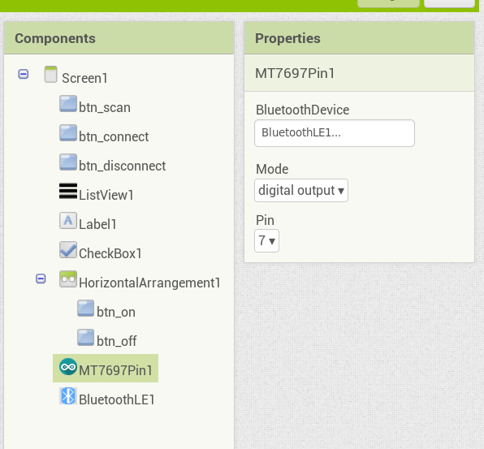
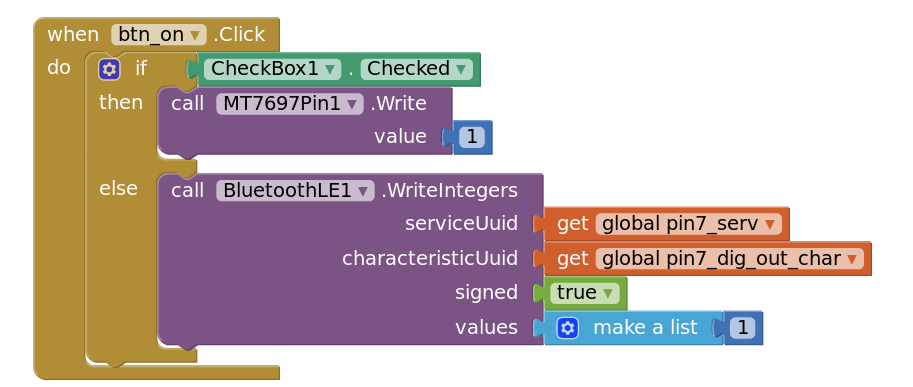
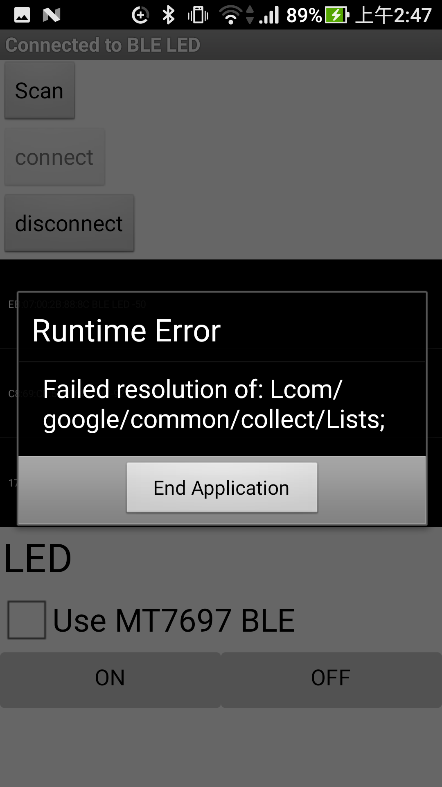

# A note for testing MT7697 BLE Component

## Test Arduino Code: ble-test.ino

1. The service and characteristic have been specified to pin 7 and digital output.

```arduino
LBLEService pin7_service("ccb7be00-77bd-4349-86a6-14cc7673ca07");
LBLECharacteristicInt pin7_char("ccb7be04-77bd-4349-86a6-14cc7673ca07", LBLE_READ | LBLE_WRITE);
```

2. If no device connected to 7697, the LED light will blink. 
After connected, the LED will extinguish.

3. Press the USR button will forcely disconnect BLE connection.

## Test APP

1. Here is the [aia](./test.aia) and [apk](./test.apk) file.
2. Set the MT7697 Component to _pin7_ and _digital output_

3. If check box be checked, i.e. using MT7697 BLE, app will use _MT7697Pin_ to write a value to board, 
otherwise use built-in BLE component to write values.
(note that it must be formed in __list of values__ to write values, even in a single one case)


## 2017-12-30

Test ble-test.ino and check whether LED can be switched by AI2 app(test.aia).

Bug report:

1. Use MT7697 BLE to write integer to 7697 but serial monitor shows 7697 received nothing.
2. Use built-in BLE component to write integers to 7697, it will cause the following bug.
, and this is a known 
[bug](https://groups.google.com/forum/#!category-topic/mitappinventortest/AgAOhYKOvko) reported in forum
but seems not yet be fixed.


